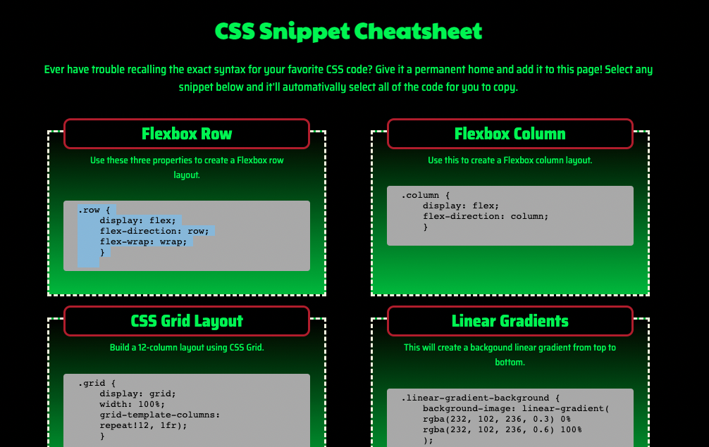

# CSS-cheatsheet

## Description
- A page containing a knowledge base of CSS snippets. 
- So they can be referenced quickly copied and applied. 
- Creating the project helped me in the creation of html and css starting from scratch.

## Installation

N/A

## Usage

A single click in the code window of each snippet highlights the code for copy.

## Credits

https://www.w3schools.com/

https://developer.mozilla.org/

## License

MIT - Please refer to the license in the Repo.

---
